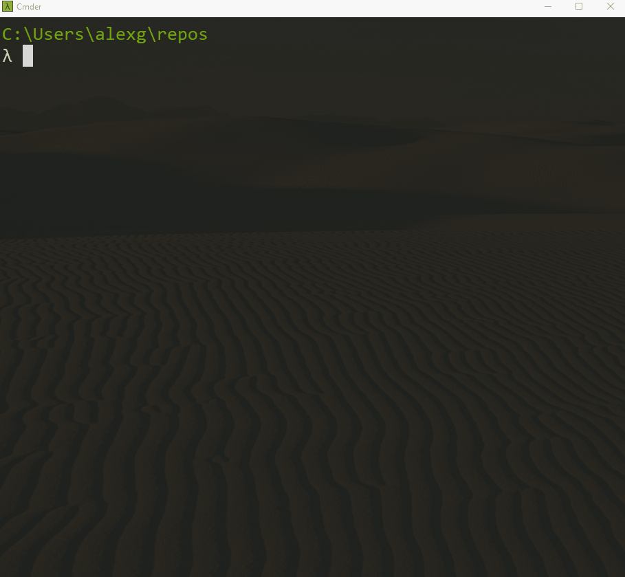

# template-dash-multipage-app

This repository will allow you to make a web app quickly and easily. No more wasting your time with HTTP port routing, Flask, Gunicorn, or any of the other rabbit holes when all you want to do is to create a responsive design website that can be customly themed in one line of code, have virtually any layout, and may contain buttons, dropdowns, forms or any other element connected to Python functions. At the end, all you want to do is put this website on the internet.


<p align="center">

</p>


## Features

* Contains several example pages with reference code on how to structure the layout of your page, create `callbacks` to add functionality and interactivity
* Can be used to create a single or multi-page webapp with your code neatly organized into different `.py` for each page on your site
* Uses `poetry` as a package manager for `Python` dependencies, which separates your `dev` tools such as `autopep8` from the actual dependencies required for your app such as `Dash`
* Configured to be easily deployed to an `Azure` cloud environment to be hosted online and accessible by anyone simply by pointing the deployment slot on `Azure` to the `GitHub` repository link of your WebApp. Furthermore, any changes pushed to `master` automatically update the live webapp.

## Background

The app uses
* [Dash](https://dash.plotly.com/)
* [Dash Bootstrap Components](https://dash-bootstrap-components.opensource.faculty.ai/)

`Dash` can create out-of-the-box interactive graphs and charts with
* [Plotly](https://plotly.com/python/)

## Installation

Use the package manager [poetry](https://python-poetry.org/) to install this project.

```bash
# Clone the repository and cd into the source code directory
cd template-dash-multipage-app\src
# Launch the virtualenv or create it if it doesn't exist
poetry shell
# install all requirements if they need to be installed
poetry update
# launch web app
python index.py
```

## Usage

To create a website or web app from scratch:
### 1. Create a new repository for your web app
* Creating a new GitHub repository with name `name-of-your-github-repo` using the GitHub web interface, and [use this repository as a template.](https://docs.github.com/en/github/creating-cloning-and-archiving-repositories/creating-a-repository-from-a-template)
* Clone the new repository locally onto your machine

### 2. Update web app name and poetry files
* Open `pyproject.toml` and add name and description as follows:
```bash
[tool.poetry]
name = "<name-of-your-github-repo>"
version = "0.1.0"
description = "<Include a description of your web app>"
authors = ...
```
* This will ensure that `Poetry` creates a virtual environment for this app with the name of your actual web app. You can view or delete the poetry virtual environments with `poetry env list` and `poetry env remove python` while in the repository. 
### 3. Launch virtual environment and install dependencies

```bash
poetry shell
poetry update
```
### 4. Update the code of the app in the `src` folder
* Open `app.py` and rename the `app_title` and adjust the theme as desired.
* As you are building your app, you can see it in your browser by running `python index.py`, and ctrl+click on the link in your terminal.
* Start editing the files in the `pages/` directory. You can delete or make duplicates of the files and create your web app as needed. Watch out for errors and limitations, for example, the callbacks and ids should be unique across the app, but if such an error comes up, then it should be self-explanatory how to fix.

### 5. Dockerize your app for deployment

Once the app is complete and functions as desired, it can now be packaged into a docker image so it can be deployed on any number of cloud platforms.

 Build the docker image by running this command from the parent folder containg `Dockerfile`
* `docker build -t name-of-your-github-repo .`
  * This builds an image with the name `name-of-your-github-repo`. Once it is done,  you can run `docker images` and you should see it listed there.

Run your created Docker image with
* `docker run -it --rm -p 8000:80 name-of-your-github-repo`

Now you should see a message like this

You can navigate to http://localhost:8000/ and you should see your app running.

This image can now be pushed to a private container registry and hosted on a cloud provider. The instructions for this step should be found in the cloud provider's documentation. 


### 6. Azure Deployment

The main thing to remember is that for Azure the port is 80 and the Dockerfile should have 

```bash
EXPOSE 80
WORKDIR /app/src

ENTRYPOINT ["gunicorn", "-w", "4", "-b", ":80", "wsgi:app"]
```

For reference, here is some documentation for
Azure: https://code.visualstudio.com/docs/containers/app-service
  
For Azure we can push the image to the Azure registry as follows [See the full insturctions here.(https://docs.microsoft.com/en-us/azure/container-registry/container-registry-get-started-docker-cli):

Tag the image
* ` docker tag name-of-your-github-repo mlascontainers.azurecr.io/name-of-your-github-repo`

Ensure that you are logged in through `az` ([see instructions here](https://docs.microsoft.com/en-us/azure/container-registry/container-registry-get-started-docker-cli)) then push the image
* `docker push mlascontainers.azurecr.io/name-of-your-github-repo`

### 7. Heroku deployment

The main thing to remember is that for some reason heroku doesn't allow you to have arguments for gunicorn other than in the format `gunicorn app:app`. So therefore, we can test the docker container locally with 

For local development use:
```bash
EXPOSE 80
WORKDIR /app/src

ENTRYPOINT ["gunicorn", "-w", "4", "-b", ":80", "wsgi:app"]
```
For heroku deploymennt use:
```bash
EXPOSE 80
WORKDIR /app/src

ENTRYPOINT ["gunicorn", "wsgi:app"]
```

The manual deployment process can then be done as follows. After logging into heroku with [heroku CLI](https://devcenter.heroku.com/articles/heroku-cli) and assuming that the Dockerfile is heroku deployment version, then the website can be updated automatically with the following to commands


Push the changes to the heroku container registry
```
heroku container:push web --app=<name of app>
```

Release the changes to the live web app
```
heroku container:release web --app=<name of app>
```
## Authors and acknowledgment

Created by Aleksandr Gontcharov <alexgoncharov@gmail.com>.

## Contributing
Pull requests are welcome. 

## Support

For help on this project or how to use it, feel free to contact Aleksandr Gontcharov.
